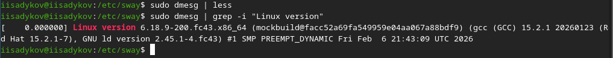
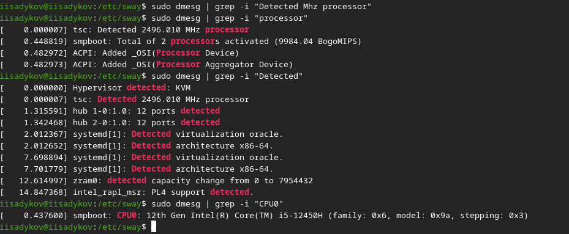

---
## Author
author:
  name: Садыков Ильдар Ильфатович
  email: sad.ildar0406@gmail.com
  affiliation:
    - name: Российский университет дружбы народов
      country: Российская Федерация
      postal-code: 117198
      city: Москва
      address: ул. Миклухо-Маклая, д. 6
## Title
title: Установка и настройка операционной системы
subtitle: Отчет по лабораторной работе №1
license: CC BY
date: today
date-format: "YYYY-MM-DD"
---

# Вводная часть

## Актуальность

- Операционная система — основа взаимодействия пользователя с компьютером
- Умение устанавливать и настраивать ОС необходимо для любого специалиста в области IT
- Навыки работы с виртуальными машинами позволяют изучать различные ОС без риска для основной системы

## Объект и предмет исследования

- Объект исследования: процесс установки операционной системы
- Предмет исследования: дистрибутив Fedora Sway и виртуальная машина VirtualBox

## Цели и задачи

**Цель:** Приобретение практических навыков установки операционной системы на виртуальную машину, настройка минимально необходимых для дальнейшей работы сервисов.

**Задачи:**
1. Установить дистрибутив Fedora Sway.
2. Выполнить базовую настройку системы.
3. Установить ПО для создания документации.
4. Проанализировать загрузку системы с помощью команды `dmesg`.

## Материалы и методы

- **Оборудование:** ПК с ОС Windows/Linux
- **ПО:** VirtualBox, образ Fedora Sway
- **Методы:** Установка по руководству, настройка через терминал, анализ логов системы

# Выполнение лабораторной работы

## Создание виртуальной машины

- Создан каталог для ВМ в VirtualBox
- Настроена ОС, подключен образ Fedora Sway для установки

## Установка операционной системы

- Выполнен запуск ВМ и установка ОС
- Настроен профиль пользователя (логин: `iisadykov`)
- Заданы пароль и язык системы

## После установки: базовая настройка

- Выполнен вход в систему
- Установлены:
  - Средства разработки
  - Обновленные пакеты
  - `tmux`
- Отключен SELinux
- Настроена русская раскладка (переключение на правый `ctrl`)
- Задано имя хоста: `iisadykov`

## После установки: ПО для документации

- Установлено программное обеспечение для создания отчетов:
  - `pandoc` и `pandoc-crossref`
  - `quarto`
  - `texlive`

# Анализ системы (домашнее задание)

## Версия ядра Linux

{#fig-01}

## Частота процессора

{#fig-02}

## Модель процессора

{#fig-03}

## Объем оперативной памяти (ОЗУ)

{#fig-04}

## Тип гипервизора

{#fig-05}

## Последовательность монтирования файловых систем

{#fig-06}

# Выводы

## Выводы

- В ходе выполнения лабораторной работы была достигнута поставленная цель
- Приобретены навыки установки ОС на виртуальную машину
- Освоены базовые команды настройки системы и анализа ее загрузки
- Подготовлена среда для выполнения последующих лабораторных работ
