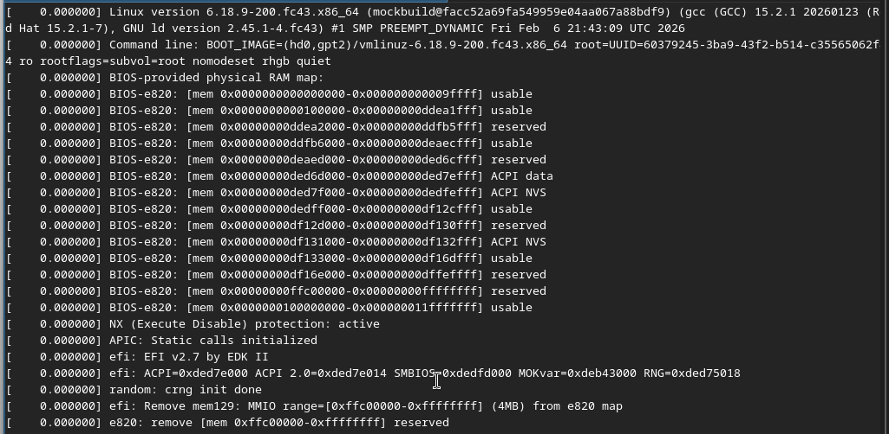
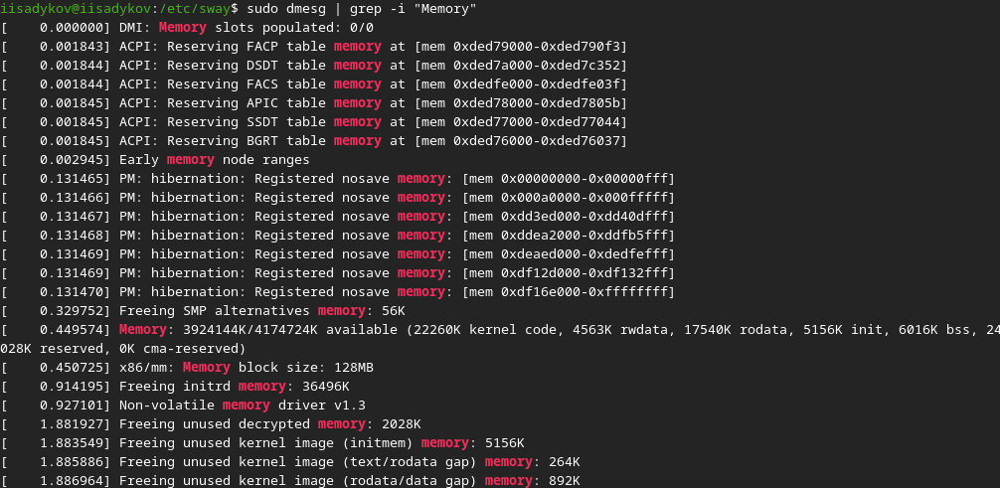
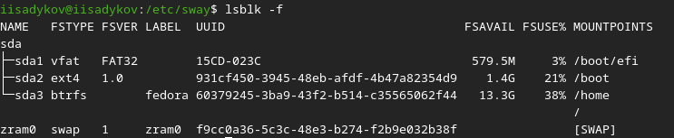

---
## Author
author:
  name: Садыков Ильдар Ильфатович
  affiliation:
    - name: Российский университет дружбы народов
      country: Российская Федерация
      postal-code: 117198
      city: Москва
      address: ул. Миклухо-Маклая, д. 6

## Title
title: "Отчет по лабораторной работе №1"
subtitle: "Архитектруа компьютеров и операционные системы"
license: "CC BY"
---

# Цель работы

Приобретение практических навыков установки операционной системы на виртуальную машину, настройка минимально необходимых для дальнейшей работы сервисов.

# Задание

1. Установить дистрибутив Fedora sway на виртуальную машину.
2. Выполнить базовую настройку системы.
3. Установить программное обеспечение для создания документации.
4. Проанализировать загрузку системы с помощью команды dmesg.
5. Оформить отчет.

# Выполнение лабораторной работы

## Создание виртуальной машины

Создаем каталог для виртуальной машины в virtualbox. Настраиваем операционную систему, подключаем образ Fedora sway.

## Установка операционной системы

Запускаем машину. Настраиваем профиль: выбираем язык системы, задаем пароль, создаем пользоваетеля по правилам наименования (iisadykov). Перезагружаем машину.

## После установки.

Выполняем вход в систему. Открываем терминал. Устанавливаем: средства разработки, обновленные пакеты, tmux. Отключаем SELinux. 

Добавляем русскую раскладку через config системы. Настраиваем переключатель раскаладки на правый ctrl. Задаем имя хоста (iisadykov). Провереям корректность.

Устаналиваем программное обеспечение для создания отчетов: скачиваем pandoc, pandoc-crossref, quarto, texlive.

# Домашнее задание.
Просматриваем информацию компьютера через команду dmesg:

- Версия ядра([рис. @fig-01]).

{#fig-01}

- Частота процессора([рис. @fig-02]).

{#fig-02}

- Модель процессора([рис. @fig-03]).

{#fig-03}

- Объем ОЗУ([рис. @fig-04]).

{#fig-04}

- Гипервизор([рис. @fig-05]).

{#fig-05}

- Последовательность монтирования([рис. @fig-06]).

{#fig-06}

# Выводы

В ходе работы установлена Fedora sway на виртулальную машину, выполенеа базовая настройка, установлено ПО для документации, проведен анализ системы.

::: {#refs}
:::
