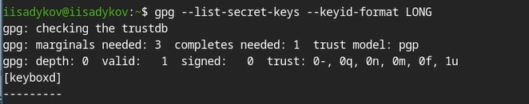
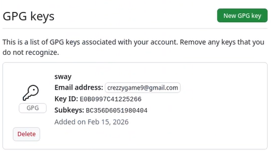
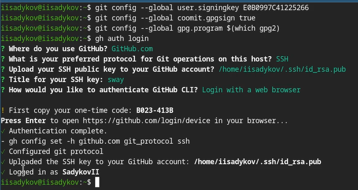
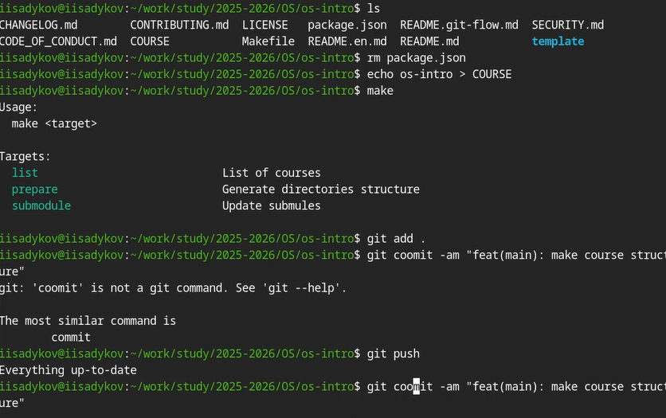

---
## Author
author:
  name: Садыков Ильдар Ильфатович
  email: sad.ildar0406@gmail.com
  affiliation:
    - name: Российский университет дружбы народов
      country: Российская Федерация
      postal-code: 117198
      city: Москва
      address: ул. Миклухо-Маклая, д. 6
## Title
title: Система контроля версий Git
subtitle: Отчет по лабораторной работе №2
license: CC BY
date: today
date-format: "YYYY-MM-DD"
---

# Вводная часть

## Актуальность

- Системы контроля версий необходимы для совместной работы над проектами
- Git — наиболее популярная система контроля версий
- Умение работать с Git и GitHub обязательно для современного разработчика
- Безопасность кода обеспечивается подписыванием коммитов

## Объект и предмет исследования

- Объект исследования: система контроля версий Git
- Предмет исследования: настройка Git, создание ключей SSH и GPG, работа с GitHub

## Цели и задачи

**Цель:** Изучить идеологию и применение средств контроля версий. Освоить умения по работе с git.

**Задачи:**
1. Создать базовую конфигурацию для работы с git
2. Создать ключи SSH и GPG
3. Настроить подписи git
4. Залогиниться на GitHub
5. Создать локальный каталог для выполнения работ

## Материалы и методы

- **Оборудование:** ПК с ОС Linux (Fedora Sway)
- **ПО:** Git, GitHub CLI (gh), OpenSSH, GnuPG
- **Методы:** Настройка через терминал, генерация ключей, работа с удаленным репозиторием

# Выполнение лабораторной работы

## Установка программного обеспечения

- Установлен Git
- Установлен GitHub CLI (gh)

## Базовая настройка git

- Заданы имя пользователя и email владельца репозитория
- Настроена кодировка UTF-8
- Задано имя начальной ветки `master`
- Настроены параметры `autocrlf` и `safecrlf`

## Создание ключа SSH

- Создан SSH ключ по алгоритму ed25519

{#fig-01}

## Создание ключа GPG

- Создан ключ GPG с типом RSA
- Размер ключа: 4096 бит
- Без срока действия
- Указаны имя и email

{#fig-02}

## Настройка GitHub

- Выполнена авторизация на GitHub
- Добавлен GPG ключ в настройки аккаунта

{#fig-03}

## Настройка подписей коммитов

- Указан ключ для подписи коммитов
- Включена автоматическая подпись коммитов
- Указана программа `gpg`
- Выполнена авторизация через браузер для gh

{#fig-04}

## Создание репозитория на GitHub

- Создан локальный каталог для работы
- Выполнено клонирование файлов из репозитория-примера

{#fig-05}

## Настройка репозитория

- Выполнена настройка репозитория
- Подготовлены каталоги для выполнения лабораторных работ
- Настроена синхронизация файлов с локальным каталогом

{#fig-06}

# Выводы

## Выводы

- В ходе выполнения работы изучена система контроля версий Git
- Освоены навыки работы с git
- Выполнена базовая настройка git
- Созданы ключи SSH и GPG
- Настроены подписи коммитов
- Создан локальный каталог для выполнения заданий
