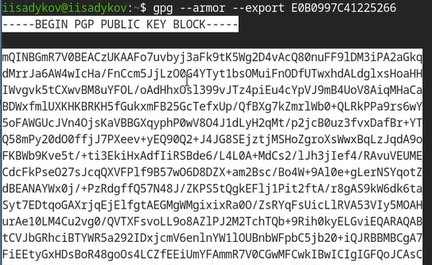
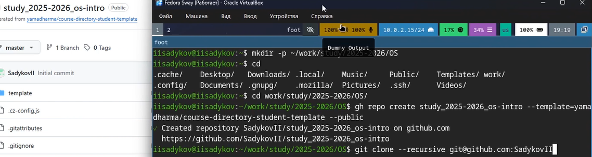

---
## Author
author:
  name: Садыков Ильдар Ильфатович
  affiliation:
    - name: Российский университет дружбы народов
      country: Российская Федерация
      postal-code: 117198
      city: Москва
      address: ул. Миклухо-Маклая, д. 6

## Title
title: "Отчет по лабораторной работе №2"
subtitle: "Архитектруа компьютеров и операционные системы"
license: "CC BY"
---

# Цель работы

Изучить идеология и применение средств контроля версий. Освоить умения по работе с git.

# Задание

1. Создать базовую конфигурацию для работы с git.
2. Создать ключи SSH и PGP.
3. Настроить подписи git.
4. Залогиниться на GitHub.
5. Создать локальный каталог для выполнения работ.

# Выполнение лабораторной работы

## Установка прогаммного обеспечения.

Устанавливаем git и gh.

## Базовая натсройка git.

Задаем имя пользователя и email владельца репозитория. Настраиваем кодировку utf-8. Задаем имя начальной ветки master. Настраиваем параметреы autocrlf и safecrlf.

## Создаем ключ SSH по алгоритму ed25519.

Создаем SSH ключ по алгоритмам rsa и ed 25519([рис. @fig-01]).

{#fig-01}

## Создаем ключ GPG.

Создаем ключ GPG с типом RSA, размером 4096, без срока действия. Указываем имя и email([рис. @fig-02]).

{#fig-02}

## Настройка GitHub.

Авторизуемся на GitHub и добавляем GPG ключ([рис. @fig-03]).

{#fig-03}

## Настройка подписей коммитов git и настройка gh.

Указан ключ для подписи коммитов, включена автоматическая подпись, указана программа gpg, выполенена авторизация через браузер([рис. @fig-04]).

{#fig-04}

## Создание репозитория на github.

Создание локального каталога и клонирование файлов из репозитория-примера([рис. @fig-05]).

{#fig-05}

## Настройка репозитория и синхронизация файлов с локальным каталогом.

Настройка репозитория и подготовка каталогов для выполенения лабаратоных работ.([рис. @fig-06]).

{#fig-06}

# Выводы

В зоде выполения работы изучена система контроля версий и освоены навыки работы с git. Выполена базовая натсройка git, созданы ключи ssh и pgp, натсроены подписи коммитов, создан локальный каталог для выполения заданий.

::: {#refs}
:::
