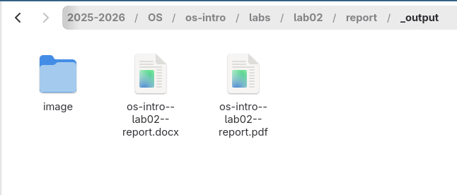
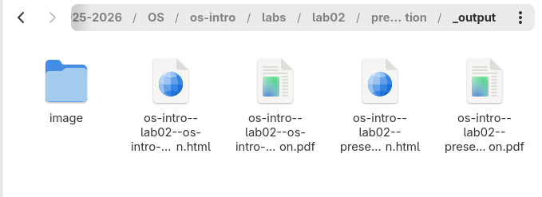

---
## Author
author:
  name: Садыков Ильдар Ильфатович
  affiliation:
    - name: Российский университет дружбы народов
      country: Российская Федерация
      postal-code: 117198
      city: Москва
      address: ул. Миклухо-Маклая, д. 6

## Title
title: "Отчет по лабораторной работе №3"
subtitle: "Архитектруа компьютеров и операционные системы"
license: "CC BY"
---

# Цель работы

Научиться офрмлять отчеты с помощью языка разметки markdown.

# Задание

Сделать отчет по предыдущей работе в формате markdown. 

# Выполнение лабораторной работы

## Создание отчета.

Открываем файл отчета в соотвествующем каталоге и редактируем его.

## Компилируем файл через quarto.

Используя команду make получаем готовые файлы в форматах: pdf, docx для отчета и pdf, html для презентации.

# Выводы

В ходе работы освоены навки оформления отчетов с помощью markdown и конвертации их в различные форматы через quarto.

::: {#refs}
:::
