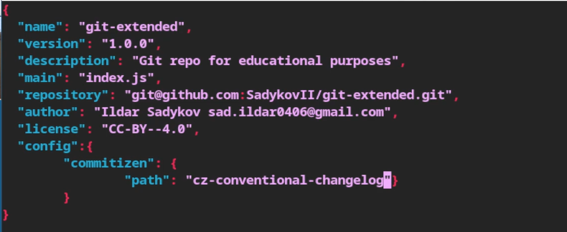
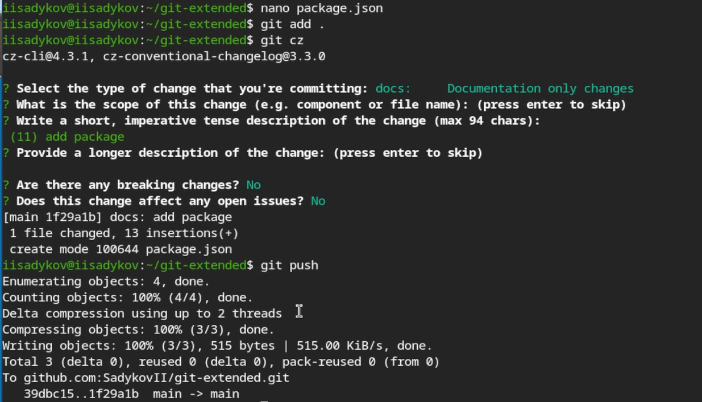
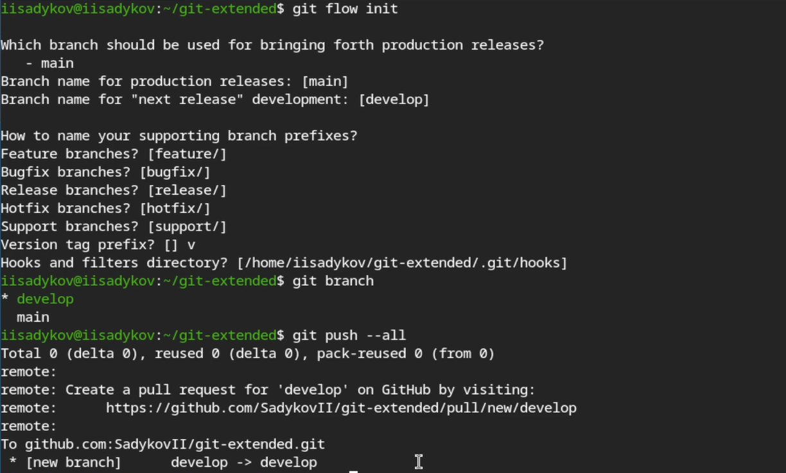
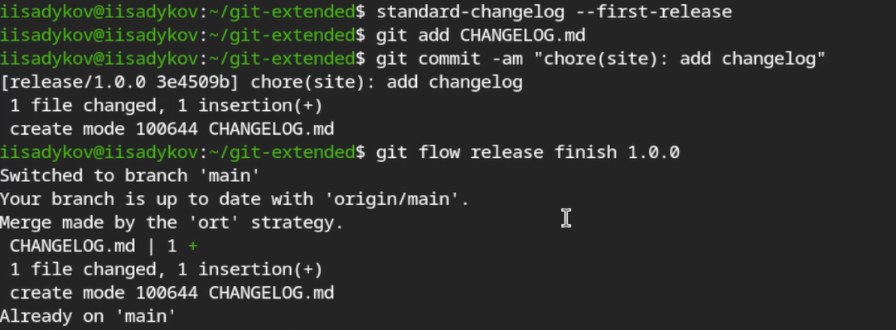
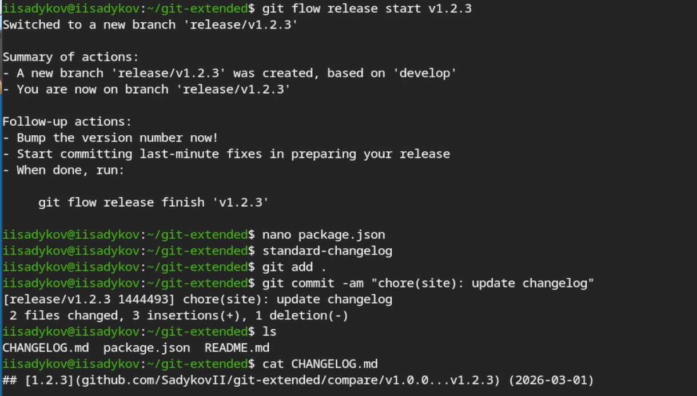

---
## Author
author:
  name: Садыков Ильдар Ильфатович
  email: sad.ildar0406@gmail.com
  affiliation:
    - name: Российский университет дружбы народов
      country: Российская Федерация
      postal-code: 117198
      city: Москва
      address: ул. Миклухо-Маклая, д. 6
## Title
title: Работа с репозиториями Git и GitFlow
subtitle: Отчет по лабораторной работе №4
license: CC BY
date: today
date-format: "YYYY-MM-DD"
---

# Вводная часть

## Актуальность

- Git — основной инструмент для управления версиями кода
- GitFlow обеспечивает структурированный подход к разработке
- Правильная работа с репозиториями критична для командной разработки
- Автоматизация создания релизов упрощает выпуск версий

## Объект и предмет исследования

- Объект исследования: процесс работы с репозиториями Git
- Предмет исследования: методология GitFlow и инструменты для работы с релизами

## Цели и задачи

**Цель:** Получение навыков правильной работы с репозиториями git.

**Задачи:**

1. Установить необходимое программное обеспечение
2. Создать репозиторий git-extended на GitHub
3. Выполнить синхронизацию локального репозитория с GitHub
4. Настроить конфигурацию коммитов
5. Настроить git-flow
6. Создать первый и второй релизы

## Материалы и методы

- **Оборудование:** ПК с ОС Linux (Fedora Sway)
- **ПО:** Git, git-flow, Node.js, npm
- **Методы:** Работа с ветками, создание релизов, семантическое версионирование

# Выполнение лабораторной работы

## Установка программного обеспечения

- Установлен git-flow
- Установлен Node.js
- Установлен npm

## Создание репозитория git

- Создан репозиторий git-extended на GitHub

{#fig-01}

## Синхронизация с GitHub

- Выполнен первый коммит
- Произведена отправка на сервер

{#fig-02}

## Конфигурация коммитов

- Инициализирован пакет Node.js
- Отредактирован файл package.json

{#fig-03}

## Коммиты с git cz

- Выполнены коммиты с помощью `git cz`
- Обеспечено форматирование сообщений коммитов

{#fig-04}

## Конфигурация git flow

- Выполнена инициализация git-flow
- Установлен префикс `v` для ярлыков
- Создан журнал изменений CHANGELOG
- Выполнена отправка релиза на GitHub

{#fig-05}

## Создание первого релиза

- Создан релиз версии 1.0.0

{#fig-06}

## Создание второго релиза

- Создан второй релиз версии 1.2.3 в ветке develop
- Внесены изменения в CHANGELOG
- Выполнена отправка на GitHub

{#fig-07}

# Выводы

## Выводы

- В ходе работы получены навыки работы с репозиториями git
- Освоен рабочий процесс gitflow
- Настроена конфигурация коммитов с использованием git cz
- Созданы релизы версий 1.0.0 и 1.2.3
- Освоено семантическое версионирование
