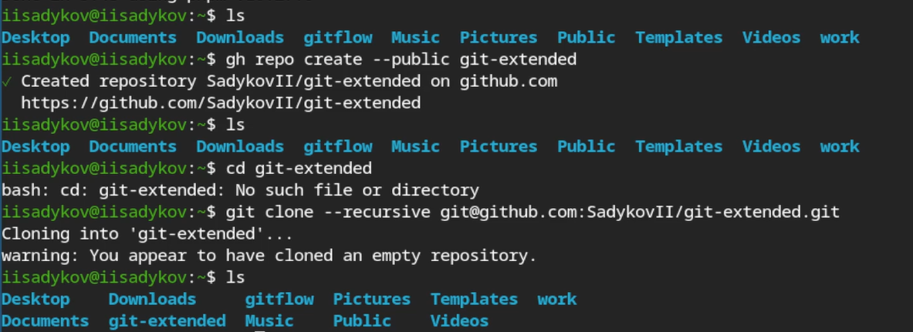
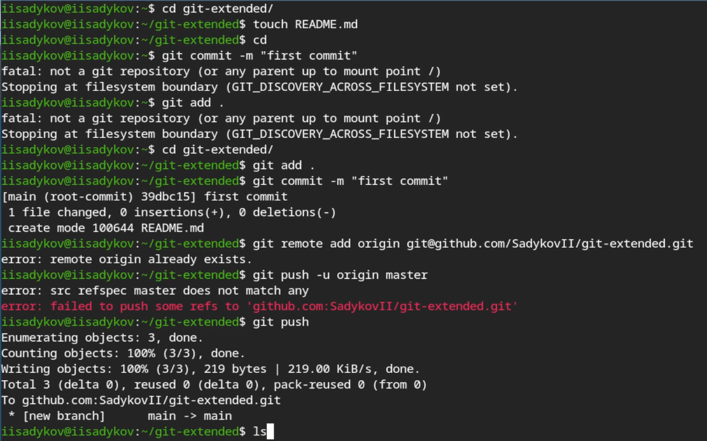

---
## Author
author:
  name: Садыков Ильдар Ильфатович
  affiliation:
    - name: Российский университет дружбы народов
      country: Российская Федерация
      postal-code: 117198
      city: Москва
      address: ул. Миклухо-Маклая, д. 6

## Title
title: "Отчет по лабораторной работе №4"
subtitle: "Архитектруа компьютеров и операционные системы"
license: "CC BY"
---

# Цель работы

Получение правильной работы с репозиториями git.

# Задание

Выполенить работы для тестового репозитория. Проеобразовать рабочий репозиторий в репозиторй с git-flow и conventional commits.

# Выполнение лабораторной работы

## Установка прогаммного обеспечения.

Устанавливаем git-flow, Nodejs,npm.

## Создаем репозиторий git.

Создан репозиторий git-exteneded на github.([рис. @fig-01]).

{#fig-01}

## Синхронизация с Github.

Первый коммит и отправка на сервер.([рис. @fig-02]).

{#fig-02}

## Конфигурация коммитов.

Инициализируем пакет Node.js. Редактируем файл package.json([рис. @fig-03]).

{#fig-03}

## Конфигурация git flow. 

Инициализация git-flow. Установлен префикс v для ярлыков. Создан журнал изменений CHANGELOG. Отправка релиза на github.([рис. @fig-05]).

{#fig-05}

## Создание первого релиза.

Создание релиза версии 1.0.0 ([рис. @fig-06]).

{#fig-06}

## Создание второго релиза.

Создан второй релиз версии 1.2.3 в ветке develop. Изменения в CHANGELOG([рис. @fig-07]).

{#fig-07}

# Выводы

В ходе работы получены навыки работы с репозиториями git, освоены рабочий процес gitflow.

::: {#refs}
:::
