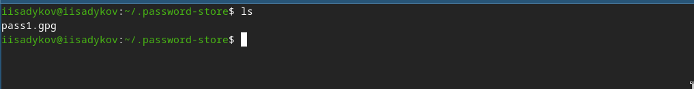

---
author:
  name: Садыков Ильдар Ильфатович
  group: НКАбд-05-24
  student-id: 1032205648
title: "Менеджер паролей pass и система управления конфигурациями chezmoi"
subtitle: "Отчет по лабораторной работе №5"
date: today
date-format: "YYYY-MM-DD"
---

# Цель работы

Настройка рабочей среды: изучение менеджера паролей pass и системы управления файлами конфигурации chezmoi.

# Задание

1. Установить и настроить менеджер паролей pass
2. Установить и настроить chezmoi для управления файлами конфигурации
3. Подключить репозиторий с dotfiles и применить конфигурацию

# Выполнение лабораторной работы

## Установка и настройка pass

- Установлен менеджер паролей pass
- Выполнен просмотр списка GPG-ключей
- Инициализировано хранилище паролей
- Создан git-репозиторий для синхронизации

## Настройка интерфейса с браузером

- Установлен browserpass для интеграции с браузером

## Сохранение пароля

- Выполнено добавление нового пароля в хранилище
- Проверено отображение сохранённого пароля

{#fig:01}

## Установка дополнительного ПО

- Установлены дополнительные пакеты и шрифты для рабочей среды

## Установка и настройка chezmoi

- Установлен chezmoi
- Создан собственный репозиторий для dotfiles на основе шаблона
- Выполнена инициализация chezmoi

## Применение конфигурации

- Выполнено применение конфигурации chezmoi
- Настроена синхронизация dotfiles

# Выводы

В ходе работы освоены инструменты для настройки рабочей среды: менеджер паролей pass и система управления файлами конфигурации chezmoi. Выполнена базовая настройка и синхронизация конфигурационных файлов.
