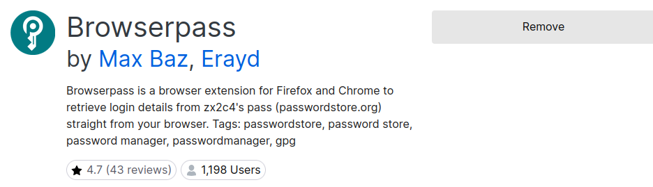
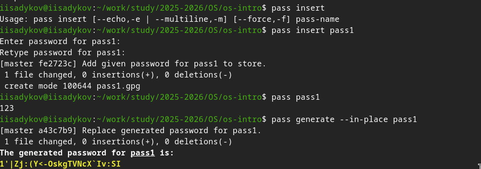
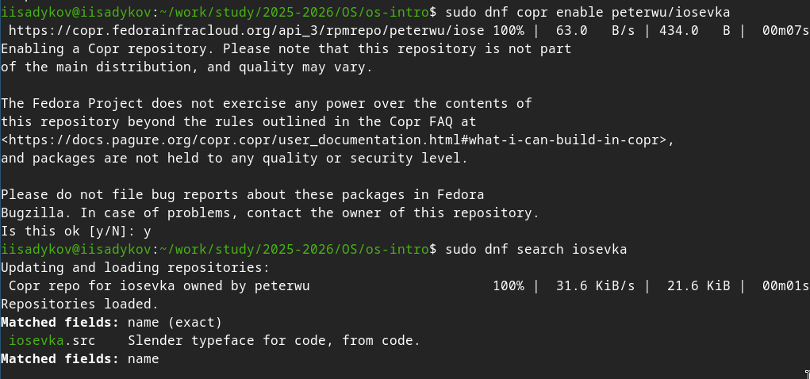

---
author:
  name: Садыков Ильдар Ильфатович
  group: НКАбд-05-24
  student-id: 1032205648
title: "Отчет по лабораторной работе №5"
subtitle: "Архитектура компьютеров и операционные системы. Раздел «Операционные системы»"
---
# Цель работы

Настройка рабочей среды: изучение менеджера паролей pass и системы управления файлами конфигурации chezmoi.

# Задание

1. Установить и настроить менеджер паролей pass.
2. Установить и настроить chezmoi для управления файлами конфигурации.
3. Подключить репозиторий с dotfiles и применить конфигурацию.

# Выполнение лабораторной работы

## Установка и настройка pass

Установлен менеджер паролей pass. Выполнен просмотр списка GPG-ключей. Инициализировано хранилище паролей. Создан git-репозиторий для синхронизации.

## Настройка интерфейса с браузером

Установлен browserpass для интеграции с браузером ([рис. @fig:2]).

{#fig:2}

## Сохранение пароля

Выполнено добавление нового пароля в хранилище. Проверено отображение сохранённого пароля ([рис. @fig:3]).

{#fig:3}

## Установка дополнительного ПО

Установлены дополнительные пакеты и шрифты для рабочей среды ([рис. @fig:4]).

{#fig:4}

## Установка и настройка chezmoi

Установлен chezmoi. Создан собственный репозиторий для dotfiles на основе шаблона. Выполнена инициализация chezmoi с репозиторием.

## Применение конфигурации

Проверены изменения, которые внесёт chezmoi. Выполнено применение конфигурации.

# Выводы

В ходе работы освоены инструменты для настройки рабочей среды: менеджер паролей pass и система управления файлами конфигурации chezmoi. Выполнена базовая настройка и синхронизация конфигурационных файлов.
