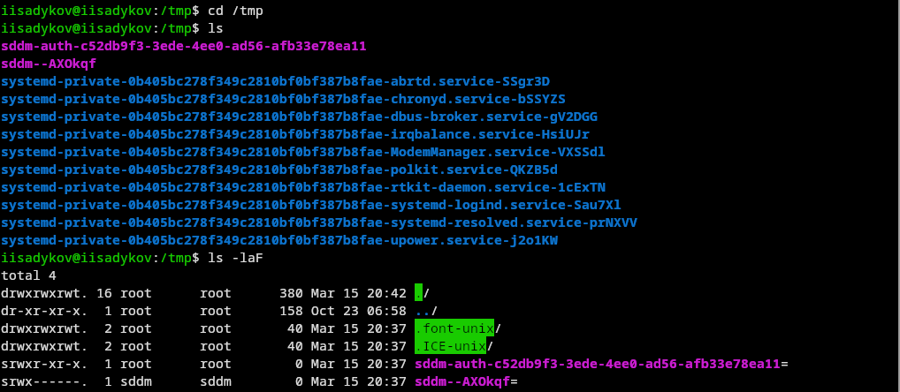
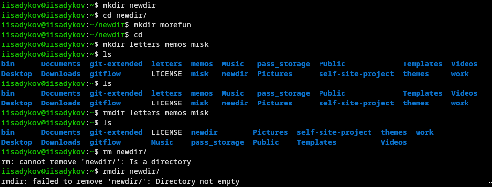
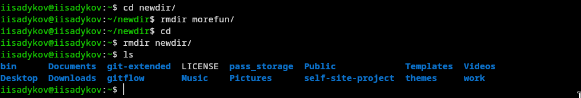
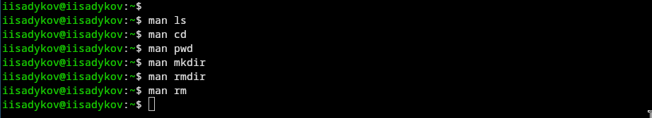
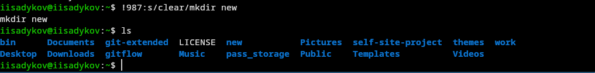

---
author:
  name: Садыков Ильдар Ильфатович
  group: НКАбд-05-24
  student-id: 1032205648
title: "Взаимодействие с системой через командную строку"
subtitle: "Отчет по лабораторной работе №6"
date: today
date-format: "YYYY-MM-DD"
---

# Цель работы

Приобретение практических навыков взаимодействия пользователя с системой посредством командной строки.

# Задание

Выполнить ряд действий с командами cd, ls, mkdir, rm, history, man для освоения работы в командной строке Unix.

# Выполнение лабораторной работы

## Определение полного имени домашнего каталога

С помощью команды pwd определено полное имя домашнего каталога:

iisadykov@iisadykov:~$ pwd
/home/iisadykov

{#fig:01}

## Работа с каталогами /tmp и /var/spool

- Выполнен переход в каталог /tmp
- Просмотрено его содержимое с разными опциями

{#fig:02}

## Проверка наличия подкаталога cron

- Проверено наличие подкаталога cron в /var/spool

{#fig:03}

## Просмотр содержимого домашнего каталога

- Выполнен переход в домашний каталог
- Просмотрено его содержимое

{#fig:04}

## Создание каталогов

- В домашнем каталоге создан каталог newdir
- В каталоге newdir создан подкаталог morefun

{#fig:05}

## Создание и удаление нескольких каталогов

- Одной командой созданы три каталога: letters, memos, misk
- Одной командой они же удалены

{#fig:06}

## Удаление каталогов с опцией -r

- Попытка удалить каталог newdir командой rm без опций не удалась
- Удаление выполнено с опцией -r
- Удалён подкаталог morefun из домашнего каталога

{#fig:07}

## Изучение опций команд через man

С помощью команды man изучены опции ls:

- -R — для просмотра подкаталогов
- -t — для сортировки по времени

{#fig:08}

## Работа с историей команд

- С помощью history просмотрен список выполненных команд
- Выполнена модификация и исполнение команд из буфера

{#fig:09}

# Выводы

В ходе работы приобретены практические навыки взаимодействия с системой Unix через командную строку, освоены основные команды для навигации, создания и удаления файлов и каталогов, работы с историей и получения справки.
