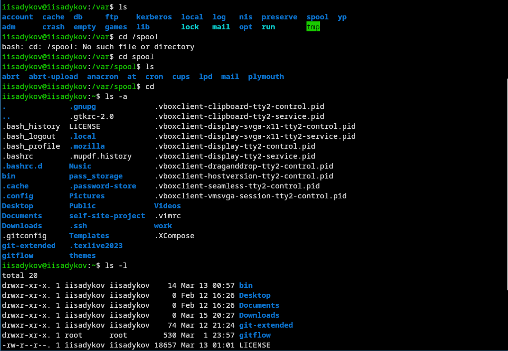
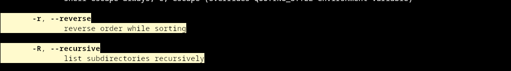
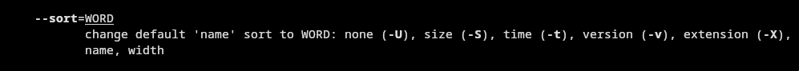

---
author:
  name: Садыков Ильдар Ильфатович
  group: НКАбд-05-24
  student-id: 1032205648
title: "Отчет по лабораторной работе №6"
subtitle: "Архитектура компьютеров и операционные системы. Раздел «Операционные системы»"
---
# Цель работы

Приобретение практических навыков взаимодействия пользователя с системой посредством командной строки.

# Задание

Выполнить ряд действий с командами cd, ls, mkdir, rm, history, man для освоения работы в командной строке Unix.

# Выполнение лабораторной работы

## 1. Определение полного имени домашнего каталога

С помощью команды pwd определено полное имя домашнего каталога ([рис. @fig-01]).

{#fig-01}

## 2. Работа с каталогами /tmp и /var/spool

Выполнен переход в каталог /tmp. Просмотрено его содержимое с разными опциями ([рис. @fig-02]).

{#fig-02}

Проверено наличие подкаталога cron в /var/spool ([рис. @fig-03]).

{#fig-03}

Выполнен переход в домашний каталог и просмотр его содержимого ([рис. @fig-04]).

{#fig-04}

## 3. Создание и удаление каталогов

В домашнем каталоге создан каталог newdir, а в нём — morefun ([рис. @fig-05]).

{#fig-05}

Одной командой созданы три каталога (letters, memos, misk) и затем одной командой удалены ([рис. @fig-06]).

{#fig-06}

Попытка удалить каталог newdir командой rm без опций не удалась. Удаление выполнено с опцией -r. Удалён подкаталог morefun из домашнего каталога ([рис. @fig-07]).

{#fig-07}

## 4-6. Изучение опций команд через man

С помощью команды man изучены опции ls для просмотра подкаталогов (-R) и сортировки по времени (-t) ([рис. @fig-08]).

{#fig-08}

## 7. Работа с историей команд

С помощью history просмотрен список выполненных команд. Выполнена модификация и исполнение команд из буфера ([рис. @fig-09]).

{#fig-09}

# Выводы

В ходе работы приобретены практические навыки взаимодействия с системой Unix через командную строку, освоены основные команды для навигации, создания и удаления файлов и каталогов, работы с историей и получения справки.

# Контрольные вопросы

1. Командная строка — интерфейс для взаимодействия пользователя с системой путём ввода текстовых команд.

2. Абсолютный путь текущего каталога можно определить командой pwd. Пример: /home/username.

3. Для определения только типа файлов и их имён используется ls -F. Пример: ls -F показывает / для каталогов, * для исполняемых.

4. Информация о скрытых файлах отображается с помощью ls -a. Пример: ls -a показывает . и .. и все файлы, начинающиеся с точки.

5. Файл удаляется командой rm, каталог — rm -r или rmdir (для пустых). Пример: rm file.txt, rm -r dir, rmdir emptydir.

6. Информация о последних выполненных командах выводится командой history.

7. Для модифицированного выполнения используется !<номер>:s/что/начто. Пример: !3:s/a/F выполнит команду 3, заменив a на F.

8. Запуск нескольких команд в одной строке: команда1; команда2; команда3. Пример: cd /tmp; ls -l; pwd.

9. Экранирование — способ отмены специального значения символов с помощью \. Пример: echo \$HOME выведет $HOME, а не значение переменной.

10. ls -l выводит: тип файла, права доступа, число ссылок, владельца, группу, размер, дату, имя.

11. Относительный путь указывается относительно текущего каталога. Пример: cd .. (относительный), cd /home/username (абсолютный).

12. Информацию о команде можно получить через man команда или команда --help.

13. Автоматическое дополнение команд — клавиша Tab.
