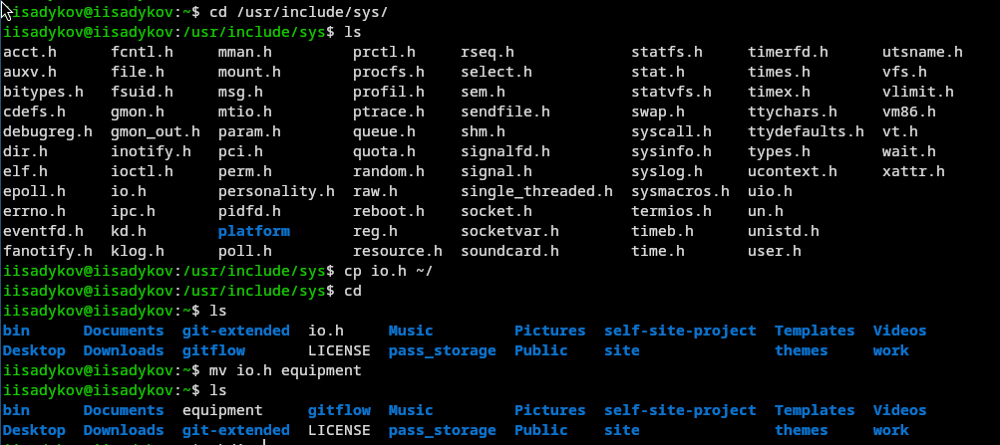
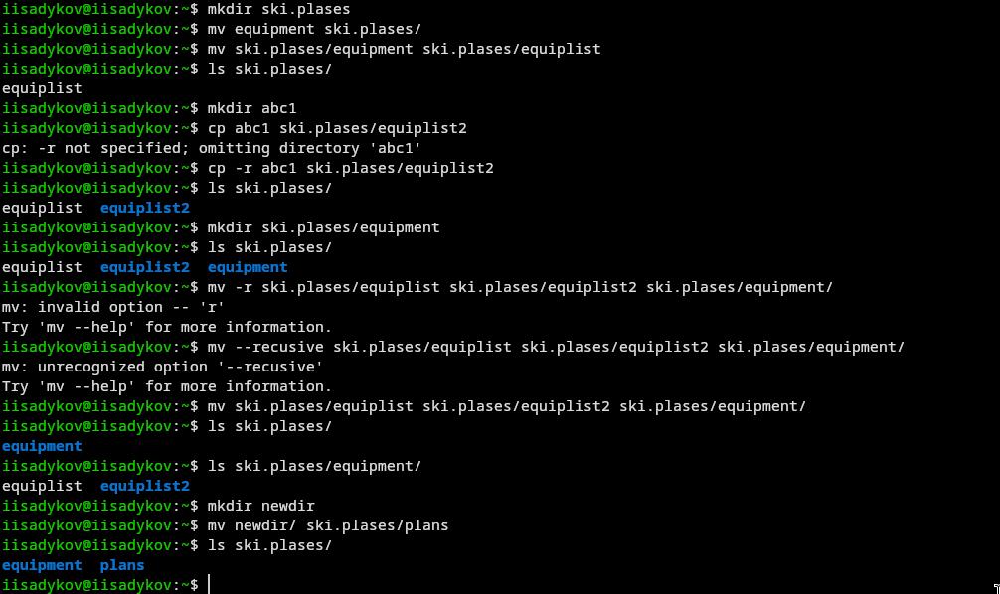

---
author:
  name: Садыков Ильдар Ильфатович
  group: НКАбд-05-24
  student-id: 1032205648
title: "Работа с файлами и каталогами в Linux"
subtitle: "Отчет по лабораторной работе №7"
date: today
date-format: "YYYY-MM-DD"
---

# Цель работы

Ознакомление с файловой системой Linux, её структурой, именами и содержанием каталогов. Приобретение практических навыков по применению команд для работы с файлами и каталогами, по управлению процессами, по проверке использования диска и обслуживанию файловой системы.

# Задание

Выполнить действия с командами для работы с файлами и каталогами, изучить права доступа и их изменение, проанализировать файловую систему.

# Выполнение лабораторной работы

## Копирование файлов и каталогов

- Выполнено копирование файлов в текущем каталоге и в подкаталоги
- Использована опция -r для рекурсивного копирования

{#fig:01}

## Продолжение операций копирования

{#fig:02}

## Перемещение и переименование файлов и каталогов

- С помощью команды mv выполнено переименование файлов и каталогов
- Выполнено перемещение файлов в другие каталоги

{#fig:03}

## Изменение прав доступа

- С помощью команды chmod изменены права доступа в символьном формате
- Изменены права доступа в числовом формате

## Анализ файловой системы

- Командой mount просмотрены смонтированные файловые системы

{#fig:04}

# Выводы

В ходе работы освоены основные команды для работы с файлами и каталогами в Linux, изучены права доступа и способы их изменения, получены навыки анализа файловой системы.
