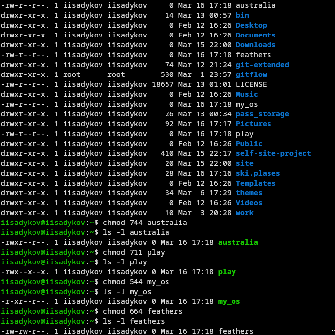
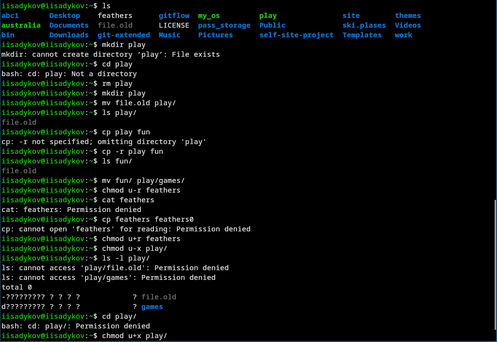

---
author:
  name: Садыков Ильдар Ильфатович
  group: НКАбд-05-24
  student-id: 1032205648
title: "Отчет по лабораторной работе №7"
subtitle: "Архитектура компьютеров и операционные системы. Раздел «Операционные системы»"
---
# Цель работы

Ознакомление с файловой системой Linux, её структурой, именами и содержанием каталогов. Приобретение практических навыков по применению команд для работы с файлами и каталогами, по управлению процессами, по проверке использования диска и обслуживанию файловой системы.

# Задание

Выполнить действия с командами для работы с файлами и каталогами, изучить права доступа и их изменение, проанализировать файловую систему.

# Выполнение лабораторной работы

## 1. Копирование файлов и каталогов

Выполнено копирование файлов в текущем каталоге и в подкаталоги. Использована опция -r для рекурсивного копирования ([рис. @fig-01]).

{#fig-01}

Продолжение выполнения операций копирования ([рис. @fig-02]).

{#fig-02}

## 2. Перемещение и переименование файлов и каталогов

С помощью команды mv выполнено переименование файлов и каталогов, а также перемещение в другие каталоги ([рис. @fig-03]).

{#fig-03}

## 3. Изменение прав доступа и анализ файловой системы

С помощью команды chmod изменены права доступа в символьном и числовом форматах. Командой mount просмотрены смонтированные файловые системы ([рис. @fig-04]).

{#fig-04}

# Выводы

В ходе работы освоены основные команды для работы с файлами и каталогами в Linux, изучены права доступа и способы их изменения, получены навыки анализа файловой системы.

# Контрольные вопросы

1. Команды для просмотра файлов: cat (вывод всего файла), less (постраничный просмотр), head (первые строки), tail (последние строки).

2. Команда cp используется с опцией -r для рекурсивного копирования каталогов. Пример: cp -r dir1 dir2.

3. Команды mv и mvdir предназначены для перемещения и переименования файлов и каталогов.

4. Права доступа определяют, кто и что может делать с файлом или каталогом: чтение (r), запись (w), выполнение (x) для владельца, группы и остальных.

5. Для изменения прав доступа используется команда chmod с символьной (u+x) или числовой (755) записью.

6. Просмотр смонтированных файловых систем: mount (без параметров) или cat /etc/fstab.

7. Для проверки использования диска используется команда df.

8. Команда mv позволяет перемещать и переименовывать файлы и каталоги. Пример: mv oldname newname, mv file dir/.

9. Права доступа — это набор разрешений для владельца, группы и остальных. Изменяются командой chmod.
