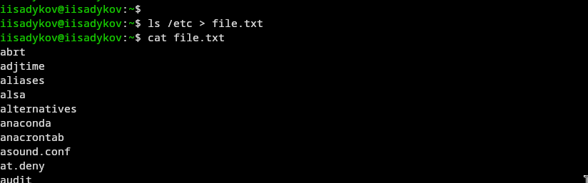
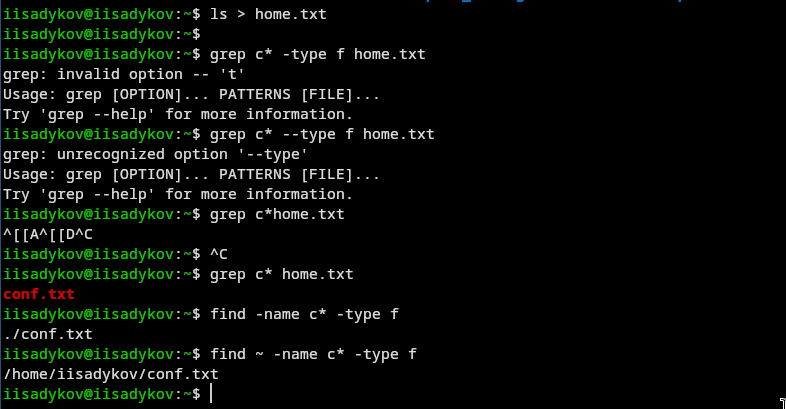
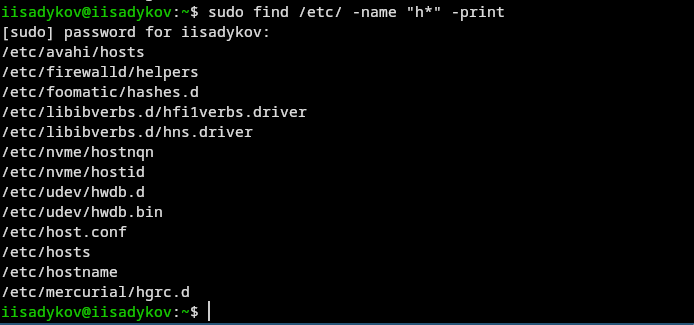
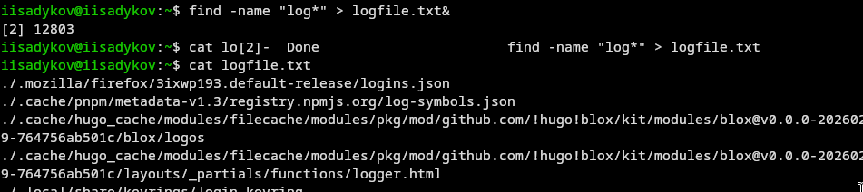
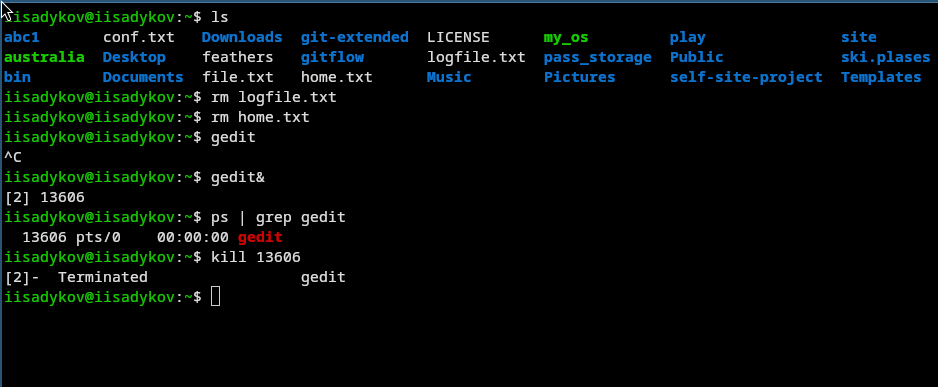
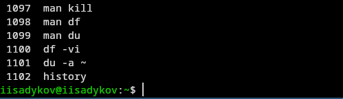
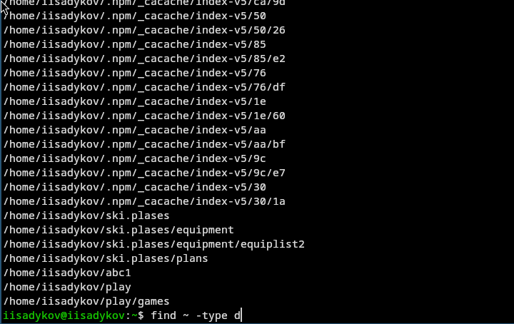

---
author:
  name: Садыков Ильдар Ильфатович
  group: НКАбд-05-24
  student-id: 1032205648
title: "Поиск файлов и фильтрация текстовых данных"
subtitle: "Отчет по лабораторной работе №8"
date: today
date-format: "YYYY-MM-DD"
---

# Цель работы

Ознакомление с инструментами поиска файлов и фильтрации текстовых данных. Приобретение практических навыков по управлению процессами, по проверке использования диска и обслуживанию файловых систем.

# Задание

Выполнить действия по перенаправлению ввода-вывода, поиску файлов, фильтрации текста, управлению процессами и проверке использования диска.

# Выполнение лабораторной работы

## Вход в систему

Осуществлён вход в систему под учётной записью пользователя.

{#fig:01}

## Запись названий файлов в file.txt

- Выполнена запись названий файлов из каталога /etc в файл file.txt
- В этот же файл дописаны названия файлов из домашнего каталога

{#fig:02}

## Поиск файлов с расширением .conf

- Из файла file.txt выделены все файлы с расширением .conf
- Результат записан в новый файл conf.txt

{#fig:03}

## Поиск файлов, начинающихся с символа с

В домашнем каталоге найдены файлы, имена которых начинаются с символа с. Использованы различные варианты команды find.

{#fig:04}

## Поиск файлов в каталоге /etc, начинающихся с h

Выведены на экран имена файлов из каталога /etc, начинающиеся с символа h.

{#fig:05}

## Запуск фонового процесса и удаление файла

- Запущен в фоновом режиме процесс, записывающий в файл ~/logfile файлы с именами, начинающимися на log
- Затем файл ~/logfile удалён

{#fig:06}

## Работа с редактором gedit

- Запущен в фоновом режиме редактор gedit
- С помощью команд ps и grep определён идентификатор процесса gedit
- Изучена команда kill, с её помощью завершён процесс gedit

{#fig:07}

## Команды df и du

- Изучена справочная информация о командах df и du с помощью man
- Выполнен вывод информации об использовании диска

{#fig:08}

## Поиск всех директорий в домашнем каталоге

С помощью команды find выведены имена всех директорий, имеющихся в домашнем каталоге.

{#fig:09}

# Выводы

В ходе работы освоены инструменты поиска файлов и фильтрации текстовых данных, приобретены навыки управления процессами, проверки использования диска и обслуживания файловых систем.
