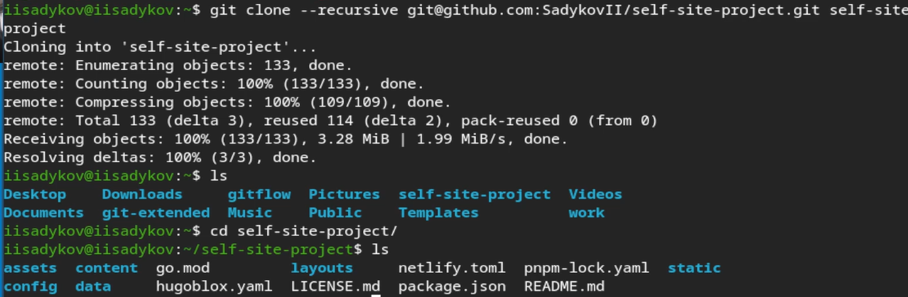
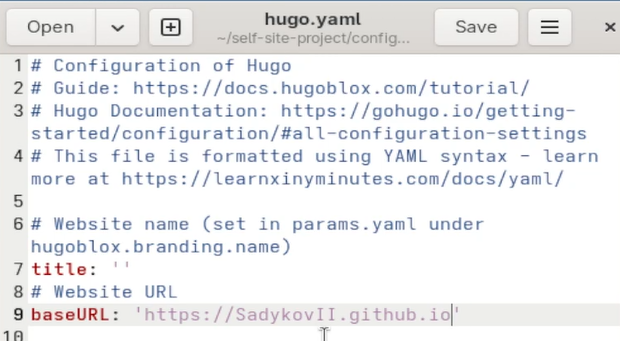
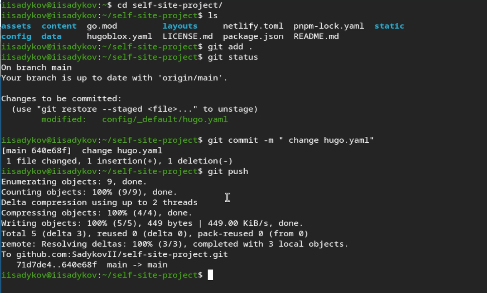

---
author:
  name: Садыков Ильдар Ильфатович
  group: НКАбд-05-24
  student-id: 1032205648
title: "Отчет по первый стадии создания персонального сайта"
subtitle: "Архитектура компьютеров и операционные системы. Раздел «Операционные системы»"
---
# Цель работы

Размещение на Github pages заготовки для персонального сайта.

# Задание

1. Установить необходимое программное обеспечение.
2. Скачать шаблон темы сайта.
3. Разместить его на хостинге git.
4. Установить параметр для URLs сайта.
5. Разместить заготовку сайта на Github pages.

# Выполнение лабораторной работы

## Подготовительный этап

Было установлено необходимое программное обеспечение. Скачан и распакован шаблон темы сайта. Создан репозиторий self-site-project на GitHub.

## Клонирование репозитория

Выполнено клонирование репозитория с шаблоном сайта на локальную машину ([рис. @fig-1]).

{#fig-1}

## Настройка URL сайта

В файле `config/_default/hugo.yaml` изменён параметр baseURL на адрес будущего сайта `https://SadykovII.github.io` ([рис. @fig-2]).

{#fig-2}

## Отправка изменений на GitHub

Изменения добавлены в индекс, создан коммит и выполнена отправка на сервер ([рис. @fig-3]).

{#fig-3}

## Просмотр результата

Заготовка сайта успешно размещена на Github pages и доступна по адресу `https://sadykovii.github.io/self-site-project/` ([рис. @fig-4]).

{#fig-4}

# Выводы

В ходе работы выполнено размещение заготовки персонального сайта на Github pages, освоены навыки работы с Hugo и публикации статических сайтов.
