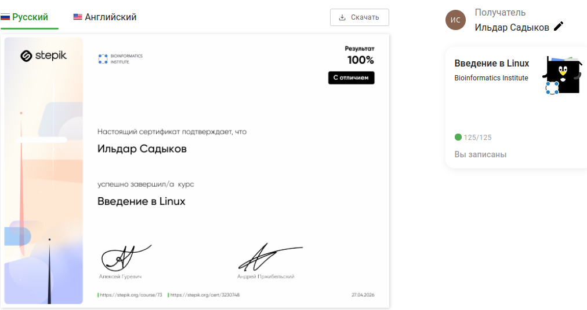

---
author:
  name: Садыков Ильдар Ильфатович
  group: НКАбд-05-24
  student-id: 1032205648
title: "Прохождение курса на stepik."
subtitle: "Архитектура компьютеров и операционные системы."
---

# Цель работы

Пройти курс, получить сертификат, выполнить контрольные мероприятия и оформить отчет.

# Задание

1. Пройти курс
2. Получить сертификат
3. Записать видео с записью камерой лица по прохождению контрольных мероприятий (тесты и задания) по каждому разделу
4. Подготовить итоговую презентацию по каждому этапу
5. Написать отчёт по прохождению контрольных мероприятий по каждому разделу

# Выполнение работы

### Раздел 1

- Пройдены тесты
- Выполнены задания

### Раздел 2

- Пройдены тесты
- Выполнены задания

### Раздел 3

- Пройдены тесты
- Выполнены задания

## Итоговая презентация

Подготовлена итоговая презентация по каждому этапу.

## Прохождение курса

Курс пройден полностью.

{#fig:01}

## Контрольные мероприятия по разделам

# Выводы

В ходе работы пройден курс, получен сертификат, выполнены контрольные мероприятия по каждому разделу с записью видео, подготовлены итоговые презентации и оформлен отчёт.

